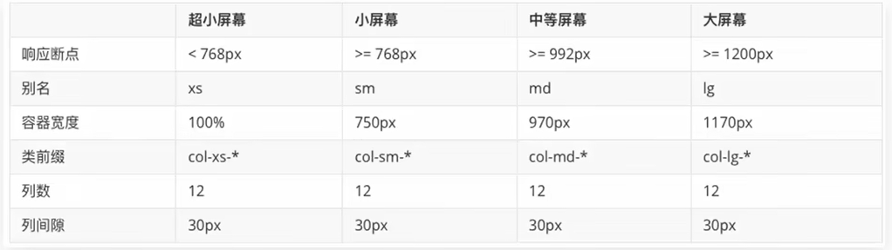

# BootStrap

<!-- TOC -->
* [BootStrap](#bootstrap)
  * [简介](#简介)
  * [引入](#引入)
  * [栅格系统](#栅格系统)
  * [全局样式](#全局样式)
<!-- TOC -->

## 简介
BootStrap框架，快速开发响应式网页。  
BootStrap框架是由Twitter公司开发维护的前端UI框架，提供了大量编写好的CSS样式，结合一定的HTML结构及JavaScript快速编写网页。  

- [BootStrap中文文档](https://www.bootcss.com/)

## 引入
引入BootStrap提供的CSS代码。

```html
<link rel="stylesheet" href="./url/bootstrap.css">
```

## 栅格系统
栅格化是指将整个网页的宽度分成若干份。BootStrap3中默认将网页分成12份。  



```html
<!--  container:使用栅格系统  -->
<div class="container">
    <!--  col-lg-3 表示该div在大屏尺寸下 占据3个栅格 ，即四个div在一行排列 -->
    <!--  col-md-6 表示该div在中屏尺寸下 占据6个栅格 ，即两个div在一行排列 -->
    <div class="col-lg-3 col-md-6">1</div>
    <div class="col-lg-3 col-md-6">2</div>
    <div class="col-lg-3 col-md-6">3</div>
    <div class="col-lg-3 col-md-6">4</div>
</div>
```

.container是BootStrap中提供的类，所有应用该类的盒子，默认被指定宽度且居中。container类自带间距15px.  
.container-fluid是BootStrap中提供的类，所有应用该类的盒子，宽度为100%.  
分别使用.row类和.col类定义栅格布局的行和列。row类自带间距-15px.  

## 全局样式
BootStrap预定义了大量类可以用来美化页面。查阅文档：全局CSS样式、组件、JavaScript插件。  
