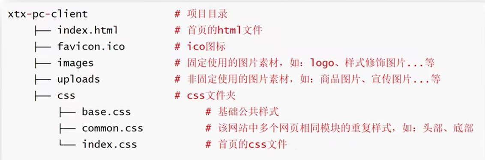

# 1·HTML简述

> HTML（Hyper Text Markup Language）：超文本标记语言。  

<!-- TOC -->
* [1·HTML简述](#1html简述)
  * [W3C（World Wide Web Consortium）：万维网联盟制定的标准](#w3cworld-wide-web-consortium万维网联盟制定的标准)
  * [浏览器内核](#浏览器内核)
  * [页面元素](#页面元素)
  * [注释](#注释)
  * [标签](#标签)
  * [页面结构](#页面结构)
  * [SEO](#seo)
    * [SEO三大标签](#seo三大标签)
  * [ico图标](#ico图标)
  * [项目目录规范](#项目目录规范)
<!-- TOC -->

## W3C（World Wide Web Consortium）：万维网联盟制定的标准

&ensp;&ensp;&ensp;&ensp;网络中的每个网页都由代码组成，但是打开网页的浏览器有很多种，浏览器内核通过渲染引擎解析前端代码
为了同样的代码在不同浏览器上都可以运行，所有浏览器都必须遵循W3C标准。在此标准下，HTML、CSS、JavaScript可以在任何浏览器中被统一解析。
而浏览器根据其内核的不同对代码的渲染优化不同，但效果大多数保持一致或相似。

## 浏览器内核

&ensp;&ensp;&ensp;&ensp;渲染引擎就是浏览器内核，负责对代码进行解析渲染。渲染引擎解析代码时的速度、性能、效果不同。
目前各浏览器内核如下：  

|      浏览器       |   内核    |     remark      |
|:--------------:|:-------:|:---------------:|
|       IE       | Trident | IE、猎豹、360、百度浏览器 |
|    FireFox     |  Gecko  |      火狐浏览器      |
|     Safari     | Webkit  |      苹果浏览器      |
| Chrome / Opera |  Blink  |    Webkit的分支    |

## 页面元素
&ensp;&ensp;&ensp;&ensp;
HTML是一种特殊的语法，通常以成对的标签形式出现，让浏览器识别并构建网页的基本元素。
通过标记的形式构建网页元素，构建网页的结构。  
&ensp;&ensp;&ensp;&ensp;
组成元素包括：文字、图片、音频、视频、超链接。

## 注释
&ensp;&ensp;&ensp;&ensp;
帮助理解代码，浏览器执行时忽略注释。
```html
<!-- 这是注释标签,内容都是注释 -->
```

## 标签
&ensp;&ensp;&ensp;&ensp;
标签通常成对出现，由<标签名>开始，到</标签名>结束。内容包裹到标签中。称为双标签。
少数标签不需要内容，如<br/>为换行符，标签自结束，不需要包裹内容，称为单标签。

## 页面结构

```html
<!--DOCTYPE：文档类型说明，告诉浏览器该网页的HTML版本-->
<!DOCTYPE html>

<!--标识网页使用的语言，作用是搜索引擎归类和浏览器翻译，常见语言：zh-CN（简体中文），en（英文）-->
<html lang="EN">

<!--head标签代表网页头部-->
<head>

    <title>网页标题</title>

    <!--meta描述性标签，它用来描述网站的一些信息-->
    <!--charset标识网页使用的字符编码，保存和打开的字符编码需要统一设置，否则可能出现乱码。-->
    <meta charset="UTF-8">
    <!--ie（兼容性差）/ edge  -->
    <meta http-equiv="X-UA-Compatible" content="IE=edge">
    <!--方便被搜索引擎查找的关键词    -->
    <meta name="keywords" content="html5">

</head>

<!--body标签代表网页主体-->
<body>

</body>
</html>
```

## SEO
SEO(Search Engine Optimization)：搜索引擎优化。  
让网站在搜索引擎上的排名靠前。  

提升SEO的方法：
1. 竞价排名（money）。
2. 将网页制作成HTML后缀。
3. 标签语义化（在合适的地方使用合适的标签）。

### SEO三大标签
1. title：网页标题标签。
2. description：网页描述标签。
3. keywords：网页关键词标签。

```html
<!doctype html>
<html lang="zh-CN">
<head>
    <meta charset="UTF-8">
    <meta name="viewport" content="width=device-width, user-scalable=no, initial-scale=1.0, maximum-scale=1.0, minimum-scale=1.0">
    <meta http-equiv="X-UA-Compatible" content="ie=edge">
    <meta name="description" content="..........描述">
    <meta name="keywords" content=".......关键词">
    <title>Document</title>
</head>
<body>
  
</body>
</html>
```

## ico图标
显示在标签页标题左侧的小图标，通常使用.ico格式的图标。  

```html
<!doctype html>
<html lang="en">
<head>
<meta charset="UTF-8">
             <meta name="viewport" content="width=device-width, user-scalable=no, initial-scale=1.0, maximum-scale=1.0, minimum-scale=1.0">
                         <meta http-equiv="X-UA-Compatible" content="ie=edge">
             <title>Document</title>
    <!--link:icon图标 通常命名为favicon.ico ，一般放在项目根目录 -->
  <link rel="shortcut icon" href="#" type="image/x-icon">
</head>
<body>
  
</body>
</html>
```

## 项目目录规范
1. 项目文件夹不使用中文。
2. favicon.ico 图标放在项目根目录。
3. images文件夹：存放网站固定使用的图片素材，如：logo、样式修饰图片...
4. uploads文件夹：存放网站非固定使用的图片素材，如：商品图片、宣传图片...
5. index.html 放在项目根目录。
6. css文件夹：保存网站的样式。
7. ./css/base.css：基础公共样式。
8. ./css/common.css：网站中多个网页相同模块的重复样式，如头部、底部。
9. ./css/index.css：首页样式。



